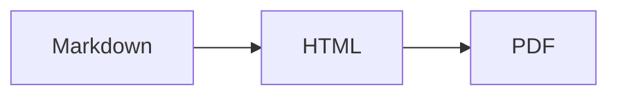

„Markdown" ist nicht eine Sprache. Es ist eine Familie, und die beiden Mitglieder, denen Sie begegnen werden, sind **CommonMark** und **GitHub Flavored Markdown (GFM)**.

CommonMark ist der standardisierte Kern: Überschriften, Hervorhebungen, Listen, Links, Code, Zitate. GFM ist CommonMark plus eine Reihe von Erweiterungen, die GitHub brauchte. Diese Erweiterungen sind heute so weit verbreitet kopiert, dass die meisten Menschen annehmen, sie gehörten zu Markdown. Das tun sie nicht, und der Unterschied erklärt die meisten Fragen vom Typ „warum wird das nicht gerendert".

## Tabellen

Nicht in CommonMark. Nur GFM:

```markdown
| Feature | Supported |
| --- | --- |
| Tables | Yes |
```

Wenn Ihre Tabellen als durch Pipes getrennter Klartext gerendert werden, ist Ihr Parser rein CommonMark. Es gibt keinen Rückgriff — entweder die Erweiterung ist da oder nicht.

## Durchstreichen

```markdown
~~outdated~~
```

Zwei Tilden. Eine einzelne Tilde bewirkt nichts.

## Aufgabenlisten

```markdown
- [x] Write the docs
- [ ] Review the PR
```

Das `[x]` muss ein kleines oder großes `x` ohne Leerzeichen innerhalb der Klammern sein. `[X]` funktioniert; `[ x ]` nicht.

## Automatische Links

GFM verwandelt nackte URLs ohne jede Syntax in Links:

```markdown
Visit https://example.com for details.
```

Es verarbeitet auch `www.`-Adressen und, bei richtiger Konfiguration, E-Mail-Adressen. Das ist die `linkify`-Option, und sie ist der Grund, warum eine URL, die Sie als literalen Text zeigen wollten, manchmal klickbar wird.

## Fußnoten

```markdown
The claim needs a source[^1].

[^1]: Gruber, J. (2004). Markdown.
```

Fußnoten sind *kein* Teil von eigentlichem GFM — GitHub hat sie später hinzugefügt, und die Unterstützung ist im Ökosystem inkonsistent. `markdown-it-footnote` implementiert sie, aber wenn Sie für einen unbekannten Renderer schreiben, verlassen Sie sich nicht darauf.

## Hinweise (das neueste und nützlichste)

GitHub hat Callouts 2023 hinzugefügt. Sie sehen aus wie ein Blockzitat mit einem Marker:

```markdown
> [!NOTE]
> Useful information that users should know.

> [!WARNING]
> Urgent info that needs immediate attention.
```

Fünf Typen: `NOTE`, `TIP`, `IMPORTANT`, `WARNING`, `CAUTION`. Sie werden auf GitHub und einer wachsenden Zahl von Static-Site-Generatoren als farbige Boxen gerendert.

Sie werden **nicht überall unterstützt**. In einem reinen CommonMark-Renderer erscheinen sie als Blockzitat, das mit dem literalen Text `[!NOTE]` beginnt, was kaputt aussieht. Nutzen Sie sie, wenn Sie wissen, dass das Ziel GitHub oder ein moderner Generator ist; vermeiden Sie sie überall dort, wo sie möglicherweise als roher Text gelesen werden.

## Mermaid-Diagramme

Eingerahmte Blöcke mit der Sprache `mermaid` werden auf GitHub als Diagramme gerendert:

````markdown

````

Überall sonst ist es ein Codeblock mit Text. Gut als Progressive Enhancement, gefährlich als einzige Kopie der Information.

## Mathe

GitHub rendert `$E = mc^2$` inline und `$$...$$` als Block mit MathJax. Die meisten anderen Renderer brauchen KaTeX explizit eingebunden. Das ist die größte Quelle für Meldungen vom Typ „die Formeln sind kaputt", wenn ein README zwischen Plattformen wandert.

## Emoji

`:smile:` wird auf GitHub zu einem Emoji. Die Shortcode-Liste ist GitHub-spezifisch, und `markdown-it-emoji` liefert drei verschiedene Sätze (`full`, `light`, `bare`), weil sich niemand einig ist, wie viele enthalten sein sollten.

## Wo die Plattformen sich uneinig sind

| Funktion | GitHub | GitLab | Notion | Obsidian |
| --- | --- | --- | --- | --- |
| Tabellen | Yes | Yes | Yes | Yes |
| Aufgabenlisten | Yes | Yes | Yes | Yes |
| Hinweise | Yes | Yes | No | Yes (Callouts) |
| Fußnoten | Yes | Yes | No | Yes |
| Mermaid | Yes | Yes | No | Yes |
| Mathe | Yes | Yes | Partial | Yes |

Obsidian nutzt ebenfalls `> [!note]`, hat aber eigene Callout-Typnamen. Notion fügt Markdown ein, speichert aber sein eigenes Blockformat. Wenn Ihr Dokument auf mehr als einer Plattform überleben muss, halten Sie sich an den CommonMark-Kern plus Tabellen und Aufgabenlisten.

## Der praktische Test

Sie können eine Variante nicht allein durch Lesen darüber verifizieren. Fügen Sie das Dokument in den Renderer ein, der Ihnen wirklich wichtig ist, und schauen Sie es sich an.

Wenn Sie einen schnellen Check über Syntaxvarianten hinweg wollen, rendert der [Markdown-Editor](/de/markdown-editor/) mit demselben Plugin-Set, das wir für [Markdown zu HTML](/de/markdown-to-html/) nutzen — Tabellen, Aufgabenlisten, Fußnoten, Mathe und Emoji eingeschaltet, sodass Sie sofort sehen, von welchen Konstrukten Ihr Inhalt abhängt.
