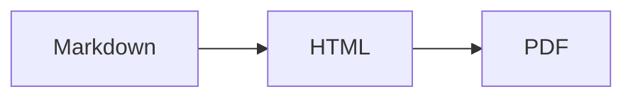

"Markdown" is not one language. It is a family, and the two members you will meet are
**CommonMark** and **GitHub Flavored Markdown (GFM)**.

CommonMark is the standardised core: headings, emphasis, lists, links, code, quotes.
GFM is CommonMark plus a set of extensions GitHub needed. Those extensions are now so
widely copied that most people assume they are part of Markdown. They are not, and the
difference explains most "why does this not render" questions.

## Tables

Not in CommonMark. GFM only:

```markdown
| Feature | Supported |
| --- | --- |
| Tables | Yes |
```

If your tables render as pipe-separated plain text, your parser is CommonMark-only.
There is no fallback — either the extension is there or it is not.

## Strikethrough

```markdown
~~outdated~~
```

Two tildes. A single tilde does nothing.

## Task lists

```markdown
- [x] Write the docs
- [ ] Review the PR
```

The `[x]` must be a lowercase or uppercase `x` with no space inside the brackets.
`[X]` works; `[ x ]` does not.

## Autolinks

GFM turns bare URLs into links without any syntax:

```markdown
Visit https://example.com for details.
```

It also handles `www.`-prefixed addresses and, with the right configuration, email
addresses. This is the `linkify` option, and it is the reason a URL you wanted shown
as literal text sometimes becomes clickable.

## Footnotes

```markdown
The claim needs a source[^1].

[^1]: Gruber, J. (2004). Markdown.
```

Footnotes are *not* part of GFM proper — GitHub added them later and support is
inconsistent across the ecosystem. `markdown-it-footnote` implements them, but if you
are writing for an unknown renderer, do not depend on them.

## Alerts (the newest one, and the most useful)

GitHub added callouts in 2023. They look like a blockquote with a marker:

```markdown
> [!NOTE]
> Useful information that users should know.

> [!WARNING]
> Urgent info that needs immediate attention.
```

Five types: `NOTE`, `TIP`, `IMPORTANT`, `WARNING`, `CAUTION`. They render as coloured
boxes on GitHub and on a growing number of static site generators.

They are **not supported everywhere**. In a plain CommonMark renderer they appear as a
blockquote starting with the literal text `[!NOTE]`, which looks broken. Use them when
you know the destination is GitHub or a modern generator; avoid them in anything that
might be read as raw text.

## Mermaid diagrams

Fenced blocks with the `mermaid` language render as diagrams on GitHub:

````markdown

````

Anywhere else it is a code block containing text. Fine as progressive enhancement,
dangerous as the only copy of information.

## Math

GitHub renders `$E = mc^2$` inline and `$$...$$` as a block, using MathJax. Most other
renderers need KaTeX wired up explicitly. This is the single biggest source of "the
formulas broke" reports when a README moves between platforms.

## Emoji

`:smile:` becomes an emoji on GitHub. The shortcode list is GitHub-specific, and
`markdown-it-emoji` ships three different sets (`full`, `light`, `bare`) because
nobody agrees on how many should be included.

## Where the platforms disagree

| Feature | GitHub | GitLab | Notion | Obsidian |
| --- | --- | --- | --- | --- |
| Tables | Yes | Yes | Yes | Yes |
| Task lists | Yes | Yes | Yes | Yes |
| Alerts | Yes | Yes | No | Yes (callouts) |
| Footnotes | Yes | Yes | No | Yes |
| Mermaid | Yes | Yes | No | Yes |
| Math | Yes | Yes | Partial | Yes |

Obsidian uses `> [!note]` too but has its own callout type names. Notion pastes in
Markdown but stores its own block format. If your document has to survive on more than
one platform, stick to the CommonMark core plus tables and task lists.

## The practical test

You cannot verify a flavour by reading about it. Paste the document into the renderer
you actually care about and look at it.

If you want a fast check across syntax variants, the
[Markdown editor](/markdown-editor/) renders with the same plugin set we use for
[Markdown to HTML](/markdown-to-html/) — tables, task lists, footnotes, math, and
emoji on, so you can see immediately which constructs your content depends on.
