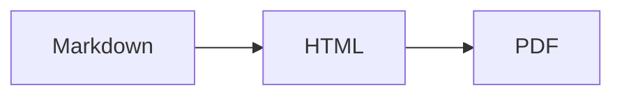

Le « Markdown » n'est pas un seul langage. C'est une famille, et les deux membres que vous rencontrerez sont le **CommonMark** et le **GitHub Flavored Markdown (GFM)**.

Le CommonMark est le cœur normalisé : titres, emphase, listes, liens, code, citations. Le GFM est le CommonMark auquel s'ajoute un ensemble d'extensions dont GitHub avait besoin. Ces extensions sont aujourd'hui si largement copiées que la plupart des gens supposent qu'elles font partie du Markdown. Ce n'est pas le cas, et cette différence explique la plupart des questions du type « pourquoi est-ce que ça ne s'affiche pas ».

## Tableaux

Absent du CommonMark. GFM uniquement :

```markdown
| Feature | Supported |
| --- | --- |
| Tables | Yes |
```

Si vos tableaux s'affichent comme du texte séparé par des barres verticales, votre analyseur est en mode CommonMark seul. Il n'y a pas de repli — soit l'extension est présente, soit elle ne l'est pas.

## Bargrature

```markdown
~~outdated~~
```

Deux tildes. Une seule tilde ne fait rien.

## Listes de tâches

```markdown
- [x] Write the docs
- [ ] Review the PR
```

Le `[x]` doit être un `x` minuscule ou majuscule sans espace à l'intérieur des crochets. `[X]` fonctionne ; `[ x ]` ne fonctionne pas.

## Liens automatiques

Le GFM transforme les URL nues en liens sans aucune syntaxe :

```markdown
Visit https://example.com for details.
```

Il gère aussi les adresses préfixées par `www.` et, avec la bonne configuration, les adresses e-mail. C'est l'option `linkify`, et c'est la raison pour laquelle une URL que vous vouliez afficher comme texte littéral devient parfois cliquable.

## Notes de bas de page

```markdown
The claim needs a source[^1].

[^1]: Gruber, J. (2004). Markdown.
```

Les notes de bas de page ne font *pas* partie du GFM proprement dit — GitHub les a ajoutées plus tard et leur prise en charge est incohérente dans l'écosystème. `markdown-it-footnote` les implémente, mais si vous écrivez pour un moteur de rendu inconnu, ne comptez pas dessus.

## Alertes (la plus récente, et la plus utile)

GitHub a ajouté les callouts en 2023. Elles ressemblent à une citation avec un marqueur :

```markdown
> [!NOTE]
> Useful information that users should know.

> [!WARNING]
> Urgent info that needs immediate attention.
```

Cinq types : `NOTE`, `TIP`, `IMPORTANT`, `WARNING`, `CAUTION`. Elles s'affichent sous forme de cases colorées sur GitHub et sur un nombre croissant de générateurs de sites statiques.

Elles ne sont **pas prises en charge partout**. Dans un moteur de rendu CommonMark simple, elles apparaissent comme une citation commençant par le texte littéral `[!NOTE]`, ce qui semble cassé. Utilisez-les quand vous savez que la destination est GitHub ou un générateur moderne ; évitez-les dans tout ce qui pourrait être lu comme du texte brut.

## Diagrammes Mermaid

Les blocs délimités avec le langage `mermaid` s'affichent comme des diagrammes sur GitHub :

````markdown

````

Partout ailleurs, c'est un bloc de code contenant du texte. Bien comme amélioration progressive, dangereux comme seule copie de l'information.

## Mathématiques

GitHub affiche `$E = mc^2$` en ligne et `$$...$$` en bloc, en utilisant MathJax. La plupart des autres moteurs de rendu ont besoin de KaTeX configuré explicitement. C'est la principale source de rapports du type « les formules sont cassées » quand un README passe d'une plateforme à l'autre.

## Emoji

`:smile:` devient un emoji sur GitHub. La liste des codes courts est spécifique à GitHub, et `markdown-it-emoji` embarque trois ensembles différents (`full`, `light`, `bare`) parce que personne ne s'accorde sur le nombre à inclure.

## Où les plateformes divergent

| Fonctionnalité | GitHub | GitLab | Notion | Obsidian |
| --- | --- | --- | --- | --- |
| Tableaux | Oui | Oui | Oui | Oui |
| Listes de tâches | Oui | Oui | Oui | Oui |
| Alertes | Oui | Oui | Non | Oui (callouts) |
| Notes de bas de page | Oui | Oui | Non | Oui |
| Mermaid | Oui | Oui | Non | Oui |
| Mathématiques | Oui | Oui | Partiel | Oui |

Obsidian utilise aussi `> [!note]` mais possède ses propres noms de type de callout. Notion accepte le Markdown en collant mais stocke son propre format de bloc. Si votre document doit survivre sur plus d'une plateforme, restez sur le cœur du CommonMark plus les tableaux et les listes de tâches.

## Le test pratique

Vous ne pouvez pas vérifier une variante en la lisant. Collez le document dans le moteur de rendu qui vous importe vraiment et regardez-le.

Si vous voulez une vérification rapide à travers les variantes de syntaxe, l'[éditeur Markdown](/fr/markdown-editor/) s'affiche avec le même jeu de plugins que nous utilisons pour [Markdown vers HTML](/fr/markdown-to-html/) — tableaux, listes de tâches, notes de bas de page, mathématiques et emoji activés, pour que vous voyiez immédiatement de quelles constructions votre contenu dépend.
