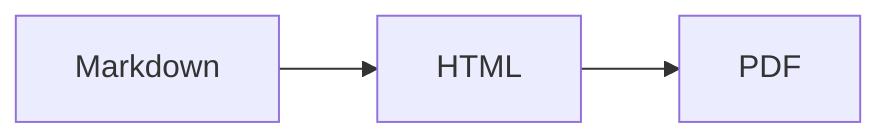

「Markdown」は単一の言語ではありません。ひとつのファミリーで、あなたが出会うのは
**CommonMark** と **GitHub Flavored Markdown（GFM）** の 2 つです。

CommonMark は標準化された中核です。見出し、強調、リスト、リンク、コード、引用。
GFM はそれに GitHub が必要とした拡張を足したものです。この拡張は今や広く模倣されているため、
多くの人が Markdown 本来の機能だと思い込んでいます。しかし違います。この差が
「なぜ表示されないのか」という質問のほとんどを説明してくれます。

## 表

CommonMark にはなく、GFM 専用です。

```markdown
| 機能 | 対応 |
| --- | --- |
| 表 | はい |
```

表が縦棒入りのプレーンテキストとして表示されるなら、そのパーサーは CommonMark 専用です。
中間の状態はありません。拡張があるかないか、どちらかです。

## 取り消し線

```markdown
~~古い情報~~
```

チルダ 2 つです。1 つでは何も起きません。

## タスクリスト

```markdown
- [x] ドキュメントを書く
- [ ] PR をレビューする
```

`[x]` は大文字小文字の `x` で、括弧内にスペースを入れてはいけません。`[X]` は有効で、
`[ x ]` は無効です。

## 自動リンク

GFM は構文なしで裸の URL をリンクに変えます。

```markdown
詳細は https://example.com をご覧ください。
```

`www.` で始まるアドレスも処理できますし、設定によってはメールアドレスも対応します。
これが `linkify` オプションです。プレーンテキストとして見せたい URL が、
ときどきクリック可能なリンクになってしまう原因でもあります。

## 脚注

```markdown
この主張には出典が必要です[^1]。

[^1]: Gruber, J. (2004). Markdown.
```

脚注は厳密には **GFM の一部ではありません**。GitHub が後から追加したもので、
エコシステム全体での対応状況はまちまちです。`markdown-it-footnote` は実装していますが、
どのレンダラーで開かれるか分からない文章を書くなら、依存しないでください。

## アラート（最も新しく、最も実用的）

GitHub は 2023 年にコールアウトを追加しました。マーカー付きの引用のような見た目です。

```markdown
> [!NOTE]
> ユーザーが知っておくと役立つ情報。

> [!WARNING]
> 至急注意が必要な情報。
```

5 種類あります。`NOTE`、`TIP`、`IMPORTANT`、`WARNING`、`CAUTION`。GitHub および
増えつつある静的サイトジェネレーターでは、色付きのボックスとして描画されます。

**どこでも使えるわけではありません。** 素の CommonMark レンダラーでは、先頭が
`[!NOTE]` という文字列の引用として表示され、壊れているように見えます。出力先が
GitHub かモダンなジェネレーターだと分かっているときに使い、プレーンテキストとして
読まれる可能性があるものでは避けてください。

## Mermaid 図

`mermaid` を言語に指定したフェンスブロックは、GitHub 上では図として描画されます。

````markdown

````

それ以外の場所では、ただのテキスト入りコードブロックです。プログレッシブ
エンハンスメントとしては良好ですが、情報の唯一のコピーとして置くのは危険です。

## 数式

GitHub は MathJax を使ってインラインの `$E = mc^2$` とブロックの `$$...$$` を描画します。
その他のレンダラーでは、たいてい KaTeX を明示的に組み込む必要があります。README が
プラットフォーム間を移動するとき、「数式が壊れた」という報告が最も多い原因がこれです。

## 絵文字

`:smile:` は GitHub 上で絵文字になります。ショートコードの一覧は GitHub 固有で、
`markdown-it-emoji` は `full`、`light`、`bare` と 3 種類のセットを同梱しています。
いくつ含めるべきか、誰の意見も一致していないからです。

## プラットフォームごとの食い違い

| 機能 | GitHub | GitLab | Notion | Obsidian |
| --- | --- | --- | --- | --- |
| 表 | はい | はい | はい | はい |
| タスクリスト | はい | はい | はい | はい |
| アラート | はい | はい | いいえ | はい（コールアウト） |
| 脚注 | はい | はい | いいえ | はい |
| Mermaid | はい | はい | いいえ | はい |
| 数式 | はい | はい | 一部 | はい |

Obsidian も `> [!note]` を使いますが、コールアウトの種類名は独自のものです。Notion は
Markdown を貼り付けられますが、内部には独自のブロック形式で保存します。複数の
プラットフォームで生き残る必要がある文書なら、CommonMark の中核に表とタスクリストを
足した範囲にとどめてください。

## 実用的な検証方法

方言は読んだだけでは確認できません。実際に使うレンダラーに文書を貼り付けて、
自分の目で見てください。

構文の扱いを手早く確認したいなら、[Markdown エディター](/ja/markdown-editor/) は
[Markdown → HTML](/ja/markdown-to-html/) と同じプラグイン構成で描画します。表、
タスクリスト、脚注、数式、絵文字がすべて有効なので、自分のコンテンツがどの拡張に
依存しているかがすぐに分かります。
