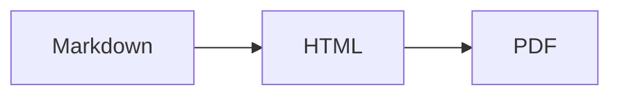

"Markdown" não é uma linguagem só. É uma família, e os dois membros que você vai
conhecer são **CommonMark** e **GitHub Flavored Markdown (GFM)**.

O CommonMark é o núcleo padronizado: títulos, ênfase, listas, links, código, citações.
O GFM é o CommonMark mais um conjunto de extensões de que o GitHub precisava. Essas
extensões agora são tão copiadas amplamente que a maioria das pessoas assume que fazem
parte do Markdown. Não fazem, e a diferença explica a maior parte das perguntas "por
que isto não renderiza".

## Tabelas

Não existe no CommonMark. Só no GFM:

```markdown
| Funcionalidade | Suportado |
| --- | --- |
| Tabelas | Sim |
```

Se suas tabelas renderizam como texto puro separado por pipes, seu analisador é
somente CommonMark. Não há fallback — ou a extensão está lá ou não está.

## Tachado (strikethrough)

```markdown
~~obsoleto~~
```

Dois tiles. Um til único não faz nada.

## Listas de tarefas

```markdown
- [x] Escrever a documentação
- [ ] Revisar o PR
```

O `[x]` deve ser um `x` minúsculo ou maiúsculo sem espaço dentro dos colchetes. `[X]`
funciona; `[ x ]` não.

## Autolinks

O GFM transforma URLs puros em links sem nenhuma sintaxe:

```markdown
Visite https://example.com para detalhes.
```

Ele também lida com endereços prefixados com `www.` e, com a configuração certa,
endereços de e-mail. Esta é a opção `linkify`, e é o motivo pelo qual uma URL que você
queria mostrar como texto literal às vezes se torna clicável.

## Notas de rodapé

```markdown
A afirmação precisa de uma fonte[^1].

[^1]: Gruber, J. (2004). Markdown.
```

Notas de rodapé *não* fazem parte do GFM propriamente dito — o GitHub as adicionou
depois e o suporte é inconsistente no ecossistema. O `markdown-it-footnote` as
implementa, mas se você está escrevendo para um renderizador desconhecido, não dependa
delas.

## Alertas (o mais novo, e o mais útil)

O GitHub adicionou callouts em 2023. Eles parecem uma citação com um marcador:

```markdown
> [!NOTE]
> Informação útil que os usuários devem saber.

> [!WARNING]
> Informação urgente que precisa de atenção imediata.
```

Cinco tipos: `NOTE`, `TIP`, `IMPORTANT`, `WARNING`, `CAUTION`. Eles renderizam como
caixas coloridas no GitHub e em um número crescente de geradores de sites estáticos.

Eles **não são suportados em todo lugar**. Em um renderizador CommonMark puro eles
aparecem como uma citação começando com o texto literal `[!NOTE]`, o que parece quebrado.
Use-os quando souber que o destino é o GitHub ou um gerador moderno; evite-os em
qualquer coisa que possa ser lida como texto cru.

## Diagramas Mermaid

Blocos cercados com a linguagem `mermaid` renderizam como diagramas no GitHub:

````markdown

````

Em qualquer outro lugar é um bloco de código contendo texto. Ótimo como aprimoramento
progressivo, perigoso como a única cópia da informação.

## Matemática

O GitHub renderiza `$E = mc^2$` inline e `$$...$$` como bloco, usando MathJax. A
maioria dos outros renderizadores precisa do KaTeX conectado explicitamente. Esta é a
maior fonte única de relatos "as fórmulas quebraram" quando um README se move entre
plataformas.

## Emoji

`:smile:` vira um emoji no GitHub. A lista de atalhos é específica do GitHub, e o
`markdown-it-emoji` traz três conjuntos diferentes (`full`, `light`, `bare`) porque
ninguém concorda sobre quantos devem ser incluídos.

## Onde as plataformas discordam

| Funcionalidade | GitHub | GitLab | Notion | Obsidian |
| --- | --- | --- | --- | --- |
| Tabelas | Sim | Sim | Sim | Sim |
| Listas de tarefas | Sim | Sim | Sim | Sim |
| Alertas | Sim | Sim | Não | Sim (callouts) |
| Notas de rodapé | Sim | Sim | Não | Sim |
| Mermaid | Sim | Sim | Não | Sim |
| Matemática | Sim | Sim | Parcial | Sim |

O Obsidian usa `> [!note]` também, mas tem seus próprios nomes de tipos de callout. O
Notion cola Markdown, mas armazena seu próprio formato de bloco. Se o seu documento tem
que sobreviver em mais de uma plataforma, fique no núcleo do CommonMark mais tabelas e
listas de tarefas.

## O teste prático

Você não consegue verificar um sabor lendo sobre ele. Cole o documento no renderizador
que você realmente se importa e olhe para ele.

Se quer uma verificação rápida entre variantes de sintaxe, o
[editor Markdown](/pt/markdown-editor/) renderiza com o mesmo conjunto de plugins que
usamos para [Markdown para HTML](/pt/markdown-to-html/) — tabelas, listas de tarefas,
notas de rodapé, matemática e emoji ativados, para que você veja imediatamente de quais
construções seu conteúdo depende.
