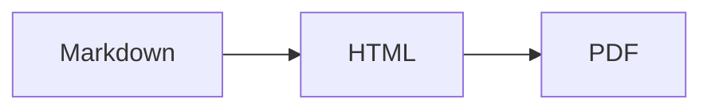

"Markdown" 不是一门语言，是一个家族。你会碰到的两个成员是 **CommonMark** 和
**GitHub 风格 Markdown（GFM）**。

CommonMark 是标准化内核：标题、强调、列表、链接、代码、引用。GFM 是 CommonMark 加上
GitHub 需要的一批扩展。这些扩展现在被抄得太广，以至于多数人以为它们本来就是
Markdown 的一部分。它们不是，而这个差别能解释大部分"为什么渲染不出来"的问题。

## 表格

CommonMark 里没有，GFM 独有：

```markdown
| 功能 | 支持 |
| --- | --- |
| 表格 | 支持 |
```

如果你的表格渲染成带竖线的纯文本，说明你的解析器只支持 CommonMark。没有中间状态，
扩展要么在要么不在。

## 删除线

```markdown
~~过时了~~
```

两个波浪号。一个没用。

## 任务列表

```markdown
- [x] 写文档
- [ ] 审 PR
```

`[x]` 必须是大小写 `x`，括号里不能有空格。`[X]` 行，`[ x ]` 不行。

## 自动链接

GFM 不用任何语法就能把裸 URL 变成链接：

```markdown
详情见 https://example.com。
```

它也能处理 `www.` 开头的地址，配置得当还能处理邮箱。这就是 `linkify` 选项，也正是
你想当纯文本展示的 URL 有时会变成可点链接的原因。

## 脚注

```markdown
这个说法需要出处[^1]。

[^1]: Gruber, J. (2004). Markdown.
```

脚注**并不属于**正统 GFM——GitHub 是后来才加的，各生态支持程度不一。
`markdown-it-footnote` 实现了它，但如果你写的东西要在未知渲染器上打开，别依赖它。

## 提示框（最新也最实用）

GitHub 在 2023 年加了 callout。写法是带标记的引用：

```markdown
> [!NOTE]
> 用户应该知道的有用信息。

> [!WARNING]
> 需要立即注意的紧急信息。
```

五种类型：`NOTE`、`TIP`、`IMPORTANT`、`WARNING`、`CAUTION`。在 GitHub 和越来越多静态
站点生成器上会渲染成彩色框。

**不是到处都支持。** 在纯 CommonMark 渲染器里，它显示成一段以字面文本 `[!NOTE]`
开头的引用，看起来就是坏了。确定目标是 GitHub 或现代生成器时用它；内容可能被当纯
文本读的时候别用。

## Mermaid 图

语言标成 `mermaid` 的栅栏块在 GitHub 上会渲染成图：

````markdown

````

别的地方它就是个装着文本的代码块。当渐进增强很好，当信息的唯一副本很危险。

## 公式

GitHub 用 MathJax 渲染行内 `$E = mc^2$` 和块级 `$$...$$`。其他渲染器大多要你显式
接好 KaTeX。README 在平台之间搬家时，"公式坏了"是最高频的投诉来源。

## 表情

`:smile:` 在 GitHub 上会变成表情。短代码表是 GitHub 专属的，而
`markdown-it-emoji` 干脆内置了三套（`full`、`light`、`bare`），因为没人就该包含多少
达成一致。

## 各平台不一致的地方

| 功能 | GitHub | GitLab | Notion | Obsidian |
| --- | --- | --- | --- | --- |
| 表格 | 支持 | 支持 | 支持 | 支持 |
| 任务列表 | 支持 | 支持 | 支持 | 支持 |
| 提示框 | 支持 | 支持 | 不支持 | 支持（callout） |
| 脚注 | 支持 | 支持 | 不支持 | 支持 |
| Mermaid | 支持 | 支持 | 不支持 | 支持 |
| 公式 | 支持 | 支持 | 部分 | 支持 |

Obsidian 也用 `> [!note]`，但 callout 类型名是自己的一套。Notion 能粘贴 Markdown，
但底层存的是自己的块格式。如果你的文档要在多个平台上活下来，就只用 CommonMark
内核加表格和任务列表。

## 实用的检验方法

光看文档没法验证方言。把文档贴进你真正在意的那个渲染器，亲眼看。

想快速检查各种语法的表现，[Markdown 编辑器](/zh-cn/markdown-editor/) 用的插件集和
[Markdown 转 HTML](/zh-cn/markdown-to-html/) 一致——表格、任务列表、脚注、公式、表情
全开，你能一眼看出自己的内容依赖了哪些扩展。
