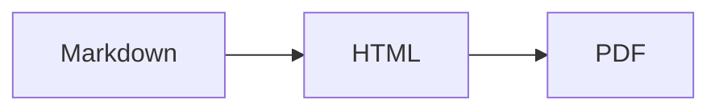

「Markdown」不是一門語言，而是一個家族。你會碰到的兩個成員是 **CommonMark** 和
**GitHub 風格 Markdown（GFM）**。

CommonMark 是標準化的核心：標題、強調、清單、連結、程式碼、引用。GFM 則是 CommonMark
加上 GitHub 需要的一批擴充。這些擴充現在被抄得太廣，以至於多數人以為它們本來就是
Markdown 的一部分。它們不是，而這個差別能解釋大部分「為什麼渲染不出來」的問題。

## 表格

CommonMark 裡沒有，GFM 獨有：

```markdown
| 功能 | 支援 |
| --- | --- |
| 表格 | 支援 |
```

如果你的表格渲染成帶直線的純文字，表示你的剖析器只支援 CommonMark。沒有中間狀態，
擴充要嘛在要嘛不在。

## 刪除線

```markdown
~~過時了~~
```

兩個波浪號。一個沒用。

## 任務清單

```markdown
- [x] 寫文件
- [ ] 審 PR
```

`[x]` 必須是大小寫 `x`，括號裡不能有空格。`[X]` 可以，`[ x ]` 不行。

## 自動連結

GFM 不用任何語法就能把裸 URL 變成連結：

```markdown
詳情見 https://example.com。
```

它也能處理 `www.` 開頭的位址，設定得當還能處理電子郵件。這就是 `linkify` 選項，也正是
你想當純文字呈現的 URL 有時會變成可點連結的原因。

## 註腳

```markdown
這個說法需要出處[^1]。

[^1]: Gruber, J. (2004). Markdown.
```

註腳**並不屬於**正統 GFM——GitHub 是後來才加的，各生態系支援程度不一。
`markdown-it-footnote` 有實作，但如果你寫的東西要在未知渲染器上開啟，別依賴它。

## 提示框（最新也最實用）

GitHub 在 2023 年加了 callout。寫法是帶標記的引用：

```markdown
> [!NOTE]
> 使用者應該知道的有用資訊。

> [!WARNING]
> 需要立即注意的緊急資訊。
```

五種類型：`NOTE`、`TIP`、`IMPORTANT`、`WARNING`、`CAUTION`。在 GitHub 和愈來愈多靜態
網站產生器上會渲染成彩色方塊。

**不是到處都支援。** 在純 CommonMark 渲染器裡，它顯示成一段以字面文字 `[!NOTE]`
開頭的引用，看起來就是壞了。確定目標是 GitHub 或現代產生器時才用；內容可能被當純
文字閱讀時別用。

## Mermaid 圖

語言標成 `mermaid` 的圍欄區塊在 GitHub 上會渲染成圖：

````markdown

````

別的地方它就是個裝著文字的程式碼區塊。當漸進增強很好，當資訊的唯一副本就很危險。

## 數學公式

GitHub 用 MathJax 渲染行內 `$E = mc^2$` 和區塊 `$$...$$`。其他渲染器大多要你明確
接好 KaTeX。README 在平臺之間搬移時，「公式壞了」是最高頻的抱怨來源。

## 表情符號

`:smile:` 在 GitHub 上會變成表情符號。短代碼表是 GitHub 專屬的，而
`markdown-it-emoji` 乾脆內建了三套（`full`、`light`、`bare`），因為沒人對該收錄多少
達成共識。

## 各平臺不一致的地方

| 功能 | GitHub | GitLab | Notion | Obsidian |
| --- | --- | --- | --- | --- |
| 表格 | 支援 | 支援 | 支援 | 支援 |
| 任務清單 | 支援 | 支援 | 支援 | 支援 |
| 提示框 | 支援 | 支援 | 不支援 | 支援（callout） |
| 註腳 | 支援 | 支援 | 不支援 | 支援 |
| Mermaid | 支援 | 支援 | 不支援 | 支援 |
| 數學公式 | 支援 | 支援 | 部分 | 支援 |

Obsidian 也用 `> [!note]`，但 callout 類型名是自己的一套。Notion 能貼上 Markdown，
但底層存的是自己的區塊格式。如果你的文件要在多個平臺上存活，就只用 CommonMark
核心加上表格和任務清單。

## 實用的檢驗方式

光看文件沒辦法驗證方言。把文件貼進你真正在意的那個渲染器，親眼看。

想快速檢查各種語法的表現，[Markdown 編輯器](/zh-tw/markdown-editor/) 用的外掛組合和
[Markdown 轉 HTML](/zh-tw/markdown-to-html/) 一致——表格、任務清單、註腳、數學公式、
表情符號全開，你能一眼看出自己的內容依賴了哪些擴充。
